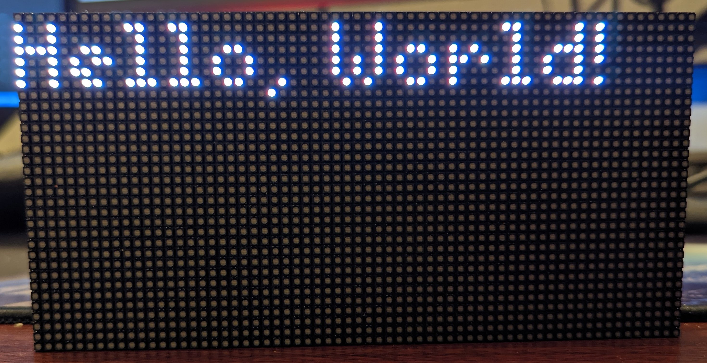

# rpi-retro-display

A Simple program to create a [TidByt&copy;](https://tidbyt.com/) like retro display using a
Raspberry Pi and a 32x64 LED Matrix.


## Disclaimer

This project is **not** affiliated or endorsed by [TidByt Inc](https://tidbyt.com/). This is one
person's attempt to use the excellent [Pixlet SDK](https://github.com/tidbyt/pixlet) to create
a TidByt&copy; clone.

## Setting Things Up

**NOTE:** I used Raspberry Pi 3B for the project. Raspberry Pi 4 is probably safe to use, but
YMMV with other models.

### 1. Set up Display

I used an [Adafruit Display](https://www.adafruit.com/product/5036) with an
[Adafruit's RPi HAT](https://www.adafruit.com/product/2345)

The RPi HAT has a comprehensive
[tutorial](https://learn.adafruit.com/adafruit-rgb-matrix-plus-real-time-clock-hat-for-raspberry-pi)
that installs a python library to control the display. The tutorial installs python bindings from
[rpi-rgb-led-matrix](https://github.com/hzeller/rpi-rgb-led-matrix) which this project uses.

_Make sure you can run the python samples from the tutorial before proceeding._

### 2. Set Up Raspberry Pi

0. Install Pre-requisites
    There are two main pre-requisites for the project
    - Python
        ```console
        $ python --version
        Python 3.9.2
        ```

        Python versions >= 3.9 should work!
    - `md5sum`
        ```console
        $ md5sum --version
        md5sum (GNU coreutils) 8.32
        Copyright (C) 2020 Free Software Foundation, Inc.
        License GPLv3+: GNU GPL version 3 or later <https://gnu.org/licenses/gpl.html>.
        This is free software: you are free to change and redistribute it.
        There is NO WARRANTY, to the extent permitted by law.

        Written by Ulrich Drepper, Scott Miller, and David Madore.
        ```

    They should both be bundled by default with Raspbian. In case they are not, make sure they are
    both installed and their binaries present in `PATH`.

1. Install [pixlet](https://github.com/tidbyt/pixlet)

    Pixlet has prebuilt `linux_arm64` binaries that can be used with RPi 4. For RPi 3/Zero, `pixlet`
    needs to be [built from source](https://github.com/tidbyt/pixlet/blob/main/docs/BUILD.md).

    Make sure the downloaded/built `pixlet` binary is in `PATH`.

    Try rendering a sample applet before continuining.

    ```console
    $ pixlet render --gif path/to/sample_applet.star
    ```

2. Download this repo

    Clone or download this repo to a directory of your choice.

3. Install project dependencies

    Intalling project dependencies used to be as simple as running
    `pip3 install -r requirements.txt`. However, Linux developers, in an attempt to save
    ourselves from ourselves have started throwing a warning if `pip3 install` is called outside
    of a virtual environment. For various reasons, this is a good decision on Linux's part.

    So, here is a quick and dirty guide to getting this project running with venv.

    1. Ensure you have `venv` installed. If not, install it using

        ```console
        $ sudo apt install python3-venv
        ```

    2. Navigate your terminal to the directory where you cloned/downloaded this repo, I will assume
       it is in `~/rpi-retro-display`

        ```console
        $ cd ~/rpi-retro-display
        ```

    3. Create a virtual environment using `venv`:

        ```console
        $ python3 -m venv --system-site-packages env
        ```

        The `--system-site-packages` flag allows venv to use packages installed globally on your
        system. `rpi-rgb-led-matrix` installs the python bindings system wide, which venv will be
        unable to find otherwise.

    4. Activate the virtual environment:

        ```console
        $ source env/bin/activate # this would need to be done for every new terminal session.
        ```

    5. Install dependencies using pip:

        ```console
        $ pip install -r requirements.txt
        ```

### 3. Run the Script

Go to this repo's directory, activate venv, and run the script with
```console
$ cd ~/rpi-retro-display
$ source env/bin/activate
$ python main.py
```

`rpi-rgb-led-matrix` asks to be run with `sudo` privileges to work properly. However, `sudo`
uses a separate environment. For `sudo` environment to find the `pixlet` binary, run

```console
$ sudo visudo
```

and add the path to `pixlet` binary in `secure_path`. It should look something like:

```
Defaults        secure_path="....:/dir/containing/pixlet"
```

Finally, run the script with:

```console
$ sudo -E $(command -v python) main.py
```

- The `-E` flag is needed for sudo to pick up all python modules available in the current environment.
- `$(command -v python)` is needed to get the path to the python interpreter that venv uses.

You should see something like



If the script throws permission error when reading/writing to the project directory, add write
permission for `Other`:

```console
$ chmod o+w /path/to/project
```

### 4. Configure Applets

The script _should_ be capable of rendering all outputs from `pixlet` so feel free to drop in
any applet you want.

To configure which applet shows on screen, add the `.star` file to [`applets/`](./applets/)
directory, and update [`config.json`](./config.json) to point to the applet.

[`config.json`](./config.json) should have the following structure:
```javascript
{
    // NOTE: Comments are **NOT** allowed in JSON.
    "applets": [
        {
            "name": "display name of applet",
            "path": "applets/my_applet.star",
            "dynamic": false, // 'true' if the applet should be called periodically to be
                              // re-rendered. Ex: the clock applet needs to be
                              // updated every minute
            "refresh_interval_ms": 0, // in milliseconds.
                                      // Interval at which the applet should be re-rendered.
                                      // Ignored if dynamic = false.
                                      // This interval is not very precise, so err on the side of
                                      // more frequent rendering. The display will only update as
                                      // needed.
            "start_time": "15:00", // time of day at which the applet should be enabled
                                   // two applets should not start at the same time
                                   // should be a valid 24 hour time
            "schema_vals": {
                // These are the user preferences that would typically be
                // Selected by the user through UI. Lacking a UI, we use the JSON
                // to set these values instead.
                "<field-id-1>": "<field-value-1>",
                "<field-id-2>": "<field-value-2>",
            }

        },
        {
            ...
        },
    ],
    "brightness": {
        "source": "schedule" | "api"
        "schedule": [ // only needed if source is "schedule"
            {
                "start_time": "05:00", // time of day at which the brightness value
                                       // should be applied.
                                       // two values must not start at the same time.
                                       // must be a valid 24 hour time.
                "value": 0.5 // Float. Brightness of the display.
                             // Applies a multiplier to the output of pixlet binary.
                             // Value ideally between 0 and 1, both inclusive, but you do you!
                             // Negative brightness will clamp to 0
            },
            {
                ...
            }
        ]
    }
}
```

The script supports basic time based automation. The `start_time` attribute of each applet will be
honored if multiple applets are present.

#### `schema_vals`:
`schema_vals` deserves its own section because it is a little complicated to set up.

To support user configuration, the pixlet SDK has a concept of
[`schema`](https://github.com/tidbyt/pixlet/blob/main/docs/schema/schema.md). Basically, the applets
are supposed to implement a `get_schema()` method which tells the TidByt&copy; stack what
options to surface to the users and then supply back to the applet at render time.

Unfortunately, it doesn't seem like there is a clean way to pull the full schema from
the applet without looking at the source, but fortunately, the schema isn't typically very
complicated. From the official docs, they tend to look something like the following:
```python
def get_schema():
    return schema.Schema(
        version = "1",
        fields = [
            schema.Text(
                id = "who",
                name = "Who?",
                desc = "Who to say hello to.",
                icon = "user",
            ),
            schema.Toggle(
                id = "small",
                name = "Display small text",
                desc = "A toggle to display smaller text.",
                icon = "compress",
                default = False,
            ),
             schema.Location(
                id = "location",
                name = "Location",
                icon = "locationDot",
                desc = "Location to spook the user with",
            ),
        ],
    )
```

The fields have two main things to look out for:
  - Field `id`: These are helpfully names `id` in the above example. Their values will be used as keys in
    our `schema_vals` object.
  - The type:
        These are described by `schema.<Type>`, so `schema.Text` is of type "Text", and
        `schema.Location` is of type "Location". \
        \
        These dictate the type of value we set as the value of the `field-id` in `schema_vals`.
        The [schema doc](https://github.com/tidbyt/pixlet/blob/main/docs/schema/schema.md) goes
        over all the possible types, and the JSON object that should be used for that type.

With those two things, the `schema_vals` for a schema as described above would look something
like:
```javascript
{
    // NOTE: Comments are **NOT** allowed in JSON.
    "applets": [
        {
            "name": "sample_applet",
            // ...
            "schema_vals": {
                "who": "Willy Wonka",
                "small": true,
                "location": {
                    "lat": "48.171895",
                    "lng": "11.532129",
                    "description": "Emmy-Noether-Straße 2, München, Germany",
                    "locality": "München", // Not sure where this comes from
                    "place_id": "ChIJZ85NtV12nkcR-q39Tk4ahVM", // From Google PlacesAPI.
                    "timezone": "Europe/Berlin"
                }
            }
        },
        {
            ...
        },
    ],
}
```

#### Brightness:

The `brightness` option is intended to dim the display output without fiddling with the `*.star`
files. It just applies a multiplier to the output of `pixlet`. `value = 0` will blank out the display, and `value = 1` will leave the output of `pixlet` untouched.

There are two ways of configuring brightness, as toggled by setting the `source` field in the `config.json`.

- `"source": "schedule"`: This allows the brigtness to be controlled on a fixed schedule. When
  `source` is set to `"schedule"`, there should be an additional `schedule` field in the config.
  See `brightness` > `schedule` field in the `config.json` schema above.

  When using `schedule` the brightness value can technically be greater than 1, but the
  display will saturate quite quickly. So feel free to experiment!

- `"source": "api"`: This allows the brightness to be controlled via a simple REST API. When `source`
  is set to `"api"`, a FastAPI server is started on port `8080`. The API is exposed at
  `http://<server_ip>:8080/brightness`.

  You can use any HTTP client to send a POST request with a JSON body containing the brightness
  value. For example, here is a curl command that sets the brightness to 50% on a device accessible
  at `tidbyt.local`:

  ```shell
  curl --request POST \
       --url "http://tidbyt.local:8080/brightness" \
       --header 'content-type: application/json' \
       --data '{ "brightness": "0.5" }'
  ```

  The `brightness` value can be any number between 0 and 1 (both inclusive), where 1 is unchanged
  pixlet output and 0 is off. Values greater than 1 is not supported in this setting.


### 5. [Optional] Extend Life Expectancy of the SD Card

SD Cards have limited read/write cycles and are prone to corruption if the power goes out while
being written to.

To update the display, this script calls the `pixlet` binary which writes a GIF file to the file
system. Depending on your [`config.json`](./config.json), this might happen multiple times a second
which can significantly reduce the SD Card's lifespan.

A simple solution is to mount a [RAM Disk](https://en.wikipedia.org/wiki/RAM_drive) which treats
your RAM as a disk drive.

A quick and dirty guide to mounting and using a ramdisk with the script follows:
1. Create a mount point for the ramdisk. I am using `/tmp/ramdisk`
    ```console
    $ sudo mkdir /tmp/ramdisk
    ```

2. Add correct permissions to the mount point
    ```console
    $ sudo chmod 777 /tmp/ramdisk
    ```

3. Mount ramdisk at the mount point
    ```console
    $ sudo mount -t tmpfs -o size=25m myramdisk /tmp/ramdisk
    ```

    **Note:** [tmpfs](https://en.wikipedia.org/wiki/Tmpfs) will use swap space if your device
    runs out of memory, which defeats the purpose of us creating a ramdisk, so make sure your
    Raspberry Pi has consistent 25MB free when under load. If you know your applets don't create
    large gifs, the tmpfs size can be reduced.

4. Check if mouting was successful
    ```console
    $ mount | grep myramdisk
    ```

    You should see an output like:
    ```console
    $ ramdisk mount | grep myramdisk
    myramdisk on /tmp/ramdisk type tmpfs (rw,relatime,size=25600k)
    ```

5. Update the script to write files to ramdisk

    Open [`pixlet_wrapper.py`](./pixlet_wrapper.py) and set `_WORKING_DIR_ROOT` to `"/tmp/ramdisk/"`.
    The line should look like:
    ```python
    _WORKING_DIR_ROOT = "/tmp/ramdisk" # update this line
    ```

6. And voila! SD Card saved!

    Note that you will have to remount the ramdisk if the Raspberry Pi reboots and all information
    in the ramdisk will be lost. How to automate mounting on boot is left as an exercise for the
    reader.

## Putting it all together in a script

Here is a quick script to automate the process of mounting the to ramdisk and running the script:
```bash
#!/bin/bash

set -eou pipefail

sudo mkdir -p /tmp/ramdisk
sudo chmod 777 /tmp/ramdisk
sudo mount -t tmpfs -o size=50m myramdisk /tmp/ramdisk

cd /home/pi/projects/rpi-retro-display
source env/bin/activate

python_location="$(command -v python)"
sudo -E "$python_location" main.py
```


## License
```
"THE BEER-WARE LICENSE" (Revision 42):
Avichal Rakesh wrote this file. As long as you retain this notice you
can do whatever you want with this stuff. If we meet some day, and you think
this stuff is worth it, you can buy me a beer in return. Avichal Rakesh
```
